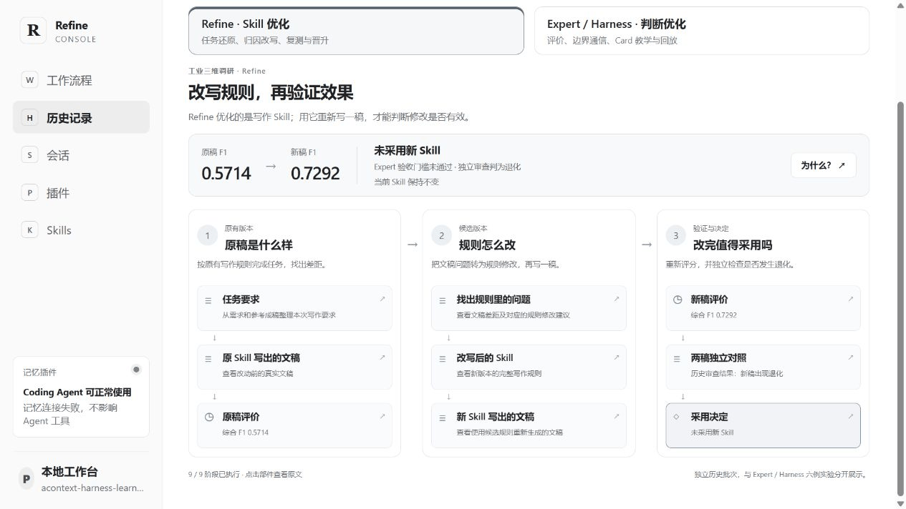

# Refine Console

让文稿改进和评价规则改进成为可观察、可复查、由人决定下一步的工作流程。

Refine 根据任务要求与参考文稿改进写作 Skill；Expert 分阶段评价文稿；Harness 比较 Expert 的多次行为，与边界审查方确认判据，再生成候选规则和教学案例。用户可以修改 Skill、补充边界、回答审查问题，并决定是否支付下一轮调用费用。



*30 秒真实界面关键帧演示。画面来自不同历史批次，不代表一次新的端到端执行；候选规则尚未验收，局部判断变化也不等于准确率提升。*

## 两条优化流程

| 流程 | 输入与处理 | 用户控制 |
| --- | --- | --- |
| Refine：改进写作 Skill | 任务要求、参考文稿、当前 Skill → 生成文稿 → Expert 评价 → 归因改写 → 再生成与复测 | 编辑本任务 Skill，查看阶段产物和费用，确认下一轮 |
| Harness：改进 Expert 判断 | 固定案例与回放缓存 → 比较 result / rationale → 核查真实 Evidence → 边界通信 → 增量约束与 bad case | 追加评价边界，回答审查问题，检查候选 Card |

比较 Harness 不重复接收整篇输入。边界讨论中的案例必须能回到原 Evidence；候选教材不会自动覆盖原 Card。缓存观察、独立回放、完整评价分数分别记录，不能相互替代。

## 快速启动

需要 Node.js **22.19.0 或更高版本**及 npm。当前主要验证环境为 Windows；Word 转换等可选功能另有系统依赖。

在项目根目录执行：

```sh
npm ci
npm run web
```

打开 <http://127.0.0.1:4318/#experts>。端口占用时使用 `npm run web -- --port 4319`。

不配置模型也能打开控制台。新安装没有你的会话、历史实验或真实任务；GIF 可直接查看，历史预设需要另行导入。Acontext 记忆服务不可用时，页面会提示，但不阻止打开工作台。

### 运行真实任务

1. 将 `.env.example` 复制为 `.env`，在本机填写模型密钥，再启动服务。`npm run web` 会读取该文件。
2. 在「工作流程」中准备 Refine 任务，提供需求记录、参考文稿和当前 Skill 的本地路径。准备步骤不调用模型。
3. 检查当前 Skill，确认后执行一轮；查看产物和已发生费用，再决定是否继续。

Harness 入口接收固定案例、回放缓存、父 Card 和费用 guard 的配置，不是从任意文稿自动找错的按钮。配置合同及逐轮交互见 [用户参与工作流](docs/human-workflows.md)。

模型调用会产生费用。界面费用是运行库记录的用量估算，不是供应商账单，也不是下一轮报价。停止会阻止后续调用，但不能撤销已发出的请求和费用。

### 查看历史实验

```sh
npm run expert-demo -- --registry /path/to/registry.json --port 4318
```

打开 `/#history`，查看 Refine 九阶段、原评价分数、Expert 判断、边界问答、Card 和回放矩阵。没有摘要执行模块时不新增摘要模型调用。导入方法见 [历史视图](docs/expert-demo.md)。

## 开发与验证

```sh
npm run check          # 类型检查、后端测试、前端逻辑测试
npm run check:release  # 发布文件、路径、文档链接与常见密钥模式检查
```

测试默认使用本地桩或模拟 provider。需要本机原始 trace 的历史回归测试默认跳过；可通过明确的路径变量启用，不纳入发布包。离线测试证明接口接线和约束，不证明模型质量收益。

主要入口：

- `src/refine-workflow-agent.ts`：固定 Refine 流程。
- `src/refine-expert-pipeline.ts`：分阶段 Expert 评价与确定性计分。
- `src/harness-multi-case.ts`：同一审查会话处理多个固定案例。
- `src/human-workflows.ts`：用户确认、问题续接、轮次和费用记录。
- `web/`：本机工作台、流程节点和详情组件。

## 配置与边界

- [模型与凭据](docs/deepseek-credentials.md)：环境变量、模型配置和费用限制。
- [用户参与工作流](docs/human-workflows.md)：Skill 编辑、边界输入、停止与重启。
- [历史视图](docs/expert-demo.md)：已有产物导入、摘要和反馈。
- [仓库结构与保留范围](docs/repository-layout.md)：当前代码、兼容模块和实验归档的区分。

控制台可读取本地文件、运行 Agent 工具并使用模型凭据，只适合可信的本机环境。不要将端口直接暴露到公网。`.env`、会话、原始 trace、预算账本、运行产物和反馈不进入 Git。

底层仍使用 `@earendil-works/pi-coding-agent`。第三方包名、插件配置键和历史兼容存储路径保留；这不代表产品仍使用旧品牌。可选 Acontext / Phoenix 集成代码保留，早期一次性实验脚本已移出发布树。

## 当前状态

这是研究阶段的本地工具，不是已证明普遍提升质量的自动训练系统。参考边界和候选教材都可能出错，必须结合真实输入复核。当前 Harness 主要支持 Matcher / Aligner 案例合同；历史六例不能代表其他任务。

仓库尚未选定开源许可证；`private: true` 防止误发布 npm 包。上传 GitHub 不自动授予开源使用许可，正式公开前需由维护者确定许可证及示例内容的发布范围。
